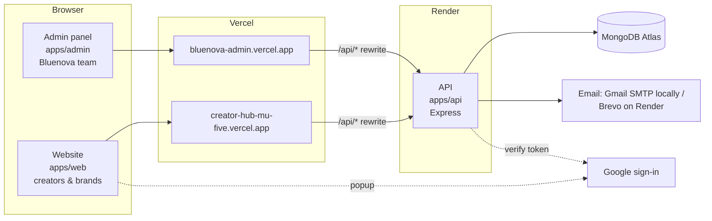

# Architecture

## 1. The big picture



- The **two websites** are static React apps hosted on Vercel.
- Each website forwards `/api/*` to the API on Render (`vercel.json` → `rewrites`). To the browser, the API looks like part of the same site, so the login cookie stays first-party and `SameSite=Strict` works.
- Locally, the Vite dev server does the same forwarding to `localhost:4000` (`vite.config.ts`).
- **One API** serves both websites. Everything is under `/api/v1`.
- **Shared code** (`packages/shared`): the validation rules, lists and state machines are written once and used by the API and both websites.

## 2. Folder map

```
apps/
  api/src/
    server.ts            start: DB → app → listen → jobs
    app.ts               middleware order + route groups
    config/env.ts        validated settings (.env)
    middleware/          auth (who?), security (rate limits, origin), validate (input), errors
    lib/                 helpers: crypto, tokens, http, audit, notify, transition, logger, userCache
    models/              MongoDB collections (see DATA_MODELS.md)
    modules/<area>/      routes (+ service for complex logic) per business area:
      auth/                signup, code, Google, login, sessions, passwords, role
      creators/            onboarding, opportunities, offers
      brands/              profile, campaigns, shortlist
      deals/               deals + notifications
      payments/            manual payments + payments switch + "start campaign"
      admin/               team screens; users.routes.ts = Admin → Users
      serializers.ts       what each role is allowed to see (allow-lists)
    providers/           outside services: email.ts, google.ts
    jobs/scheduler.ts    offer expiry every 10 min
    scripts/             seed, seedSuperAdmin, devMemory (demo), testEmail
  api/tests/             automated tests (in-memory MongoDB)
  web/src/
    main.tsx             providers: data cache → auth → router
    App.tsx              URL → page, plus guards
    lib/                 api client, auth context, config, i18n, formatting
    components/          layouts (public / auth / app), shared bits
    pages/<area>/        auth, creator, brand, public, shared
    i18n/en.json, gu.json  all texts (same keys in both)
  admin/src/
    main.tsx             admin URL → page
    lib.tsx              admin api client, messages, helpers
    pages/               Shell (login + frame), Pages (work screens), Finance, Users
packages/
  shared/src/          schemas, validators, enums, catalog, state machines, money, matching
  ui/src/              components (design system) + browser API client
docs/                  you are here
```

## 3. Life of a request (API)

Here is `POST /api/v1/auth/login` as an example. The order is set in `apps/api/src/app.ts`.

| # | Step | File | Can stop the request with |
|---|---|---|---|
| 1 | Give it an id | `middleware/security.ts` → `requestId` | – |
| 2 | Log it (secrets redacted) | `lib/logger.ts` | – |
| 3 | Security headers | `helmet` | – |
| 4 | CORS: is the website allowed? | `cors` with `CORS_ORIGINS` | blocked by the browser |
| 5 | Read the JSON body (max 100 kb) and cookies | express | 400 |
| 6 | Strip `$`-operators, duplicate params | mongoSanitize, hpp | – |
| 7 | Global rate limit | `rateLimits.global` | 429 |
| 8 | No caching, Origin check | `noStore`, `originCheck` | 403 |
| 9 | Route-specific rate limit | `rateLimits.login` | 429 |
| 10 | **Who are you?** (protected routes) | `authenticate('app')` | 401 |
| 11 | **Are you allowed?** | `authorize('brand')` / `requireAdmin('finance')` | 403 |
| 12 | **Is the input valid?** | `validate({ body: loginSchema })` | 400 + field errors |
| 13 | Do the work | the route handler (+ `*.service.ts`), with ownership filters | 404 / 409 |
| 14 | Reply `{ data }` | `lib/http.ts` → `ok()` | – |
| ✖ | Anything thrown | `middleware/errors.ts` → `{ error }` | – |

## 4. Life of a page (website)

1. `main.tsx` mounts `QueryClientProvider` (fetching and caching), then `AuthProvider` (on load: `POST /auth/refresh` to restore the session), then `RouterProvider`.
2. `App.tsx` picks the page for the URL. Guards (`GuestOnly`, `RequireSignedIn`, `RequireRole`) redirect if needed.
3. The page loads data with `useQuery(() => api.get('/…'))` and sends forms with `api.post(...)`.
4. Forms use **react-hook-form + zod**. The same schema the API uses gives instant errors; server field errors are placed under the right inputs (`applyServerErrors`).
5. Texts come from `t('key')`: `i18n/gu.json` (default) or `en.json`.

## 5. Environments

| | Local (`npm run dev`) | Demo (`npm run dev:demo`) | Live |
|---|---|---|---|
| Database | Your Atlas DB (`apps/api/.env`) | In-memory, resets on stop | Atlas (Render env) |
| Email | `EMAIL_PROVIDER` in `.env` (Gmail SMTP works) | printed in the terminal | Brevo (Render blocks SMTP) or `TEST_MODE` |
| Website / admin | localhost:5180 / 5181 | same | Vercel |
| API | localhost:4000 | same | bluenova-api.onrender.com |

The free Render plan sleeps after ~15 minutes idle, so the first request after that takes ~30–60 s.

## 6. Key design decisions
See [DECISIONS.md](DECISIONS.md) for the full log. In short:
- **Managed marketplace:** brands see only Bluenova's shortlist, never contact details.
- **Role chosen after the first login:** the signup form stays tiny, and Google signups have no extra questions.
- **Payments switched off** while testing: the team starts campaigns manually.
- **npm workspaces** (no Docker/Redis yet): in-process rate limits, cache and scheduler, so the API runs as **one instance** until Redis is added.
