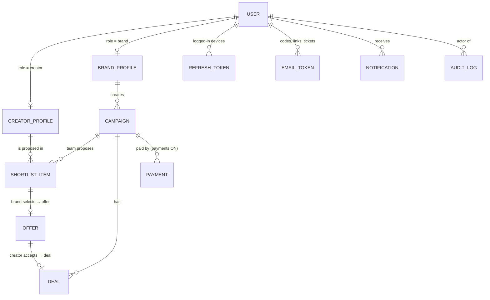
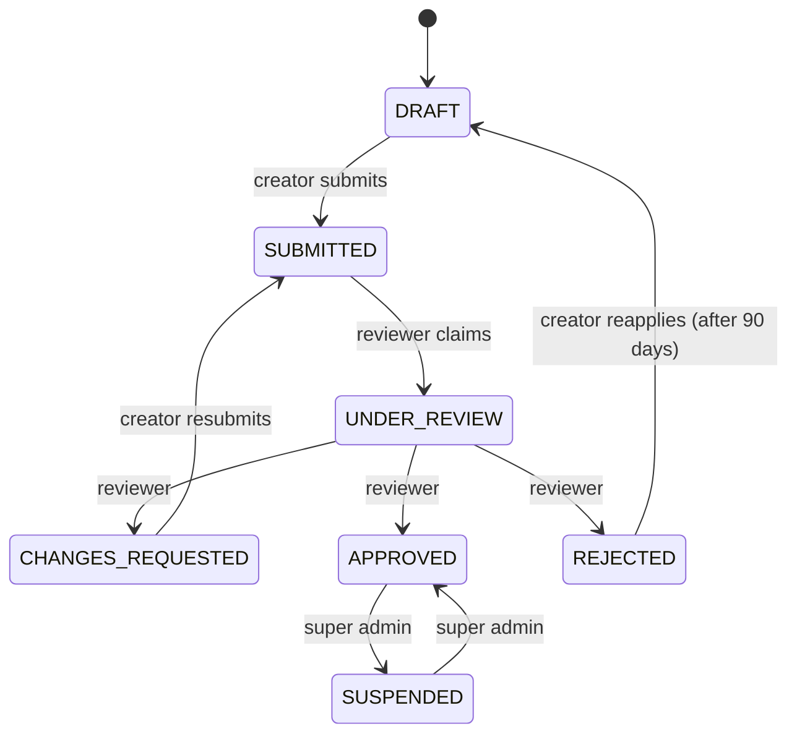
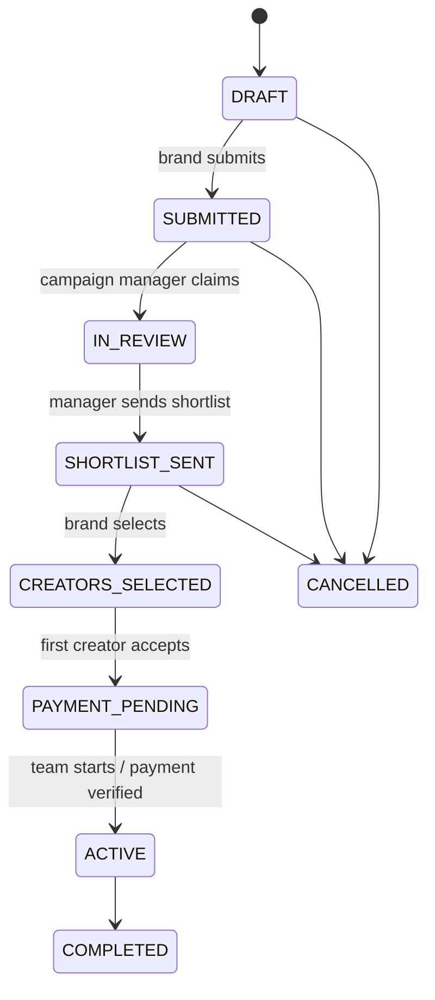

# Data models (MongoDB collections)

This is what is stored in the database, and why. The Mongoose model files live in `apps/api/src/models/`.
(If you heard "modal": that's a pop-up window, and those are listed in [FLOWS.md §5](FLOWS.md#5-pop-up-windows-dialogs--modals). This page is about data **models**.)

**Rules that apply to every model**
- All money is stored as **whole paise**: `…Paise` fields. ₹1,500 = `150000`.
- Rates are **basis points**: `…Bps` fields. 25% = `2500`, 5.25% = `525`.
- Every document has `_id`, `createdAt` and `updatedAt`. Audit log entries have only `createdAt`.
- **Secrets are never stored in readable form:**
  - passwords are **argon2id** hashes;
  - tokens and codes are **SHA-256 / HMAC** fingerprints;
  - the admins' authenticator keys are **AES-256-GCM** encrypted.
- Fields marked `select: false` are left out of normal queries and have to be requested explicitly.
- Statuses only change through the state machines (bottom of this page).

## How the collections connect

---

## `users` (`models/user.ts`)
One per account: creator, brand, not-chosen-yet, or team member. Holds **login data only**.

| Field | Meaning |
|---|---|
| `name`, `email` | Email is unique, stored lowercase, and is the login identifier |
| `role` | `creator`, `brand`, `admin`, or **`null` = hasn't chosen yet** (set once via `/auth/role`) |
| `adminRole` | Team members only: `super_admin`, `reviewer`, `campaign_manager`, `finance` |
| `emailVerifiedAt` | When the 6-digit code was entered (or Google proved the email) |
| `passwordHash` | argon2id hash. **select:false**. Empty for Google-only accounts. |
| `googleId` | Google's permanent id for this person (unique) |
| `passwordChangedAt`, `lastLoginAt` | Shown in admin → Users |
| `status` | `active`, `suspended`, `deletion_pending` or `deleted`. Only `active` can log in. |
| `tokenVersion` | Raised by 1 to log someone out of every device instantly |
| `preferredLanguage` | `gu` or `en` |
| `consents[]` | What they accepted (`terms`, `privacy`, `creator_agreement`, `brand_agreement`), plus version, time and IP |
| `totpSecret` | Admins: encrypted authenticator key. **select:false**. |
| `totpEnabled`, `totpLastStep` | Admins: makes each authenticator code work only once |

## Login collections (`models/auth.ts`)
| Collection | One document = | Key fields | Auto-deleted |
|---|---|---|---|
| `refreshtokens` | one logged-in device | `tokenHash` (SHA-256 of the cookie), `familyId` (one login), `kind` (user/admin), `revokedAt`, `revokedReason` (`rotated`, `logout`, `reuse_detected`, …), `ip`, `userAgent` | at expiry |
| `emailtokens` | one one-time email secret | `purpose`: `reset_password` / `verify_otp` / `signup_ticket`; `tokenHash`; `codeHash` (6-digit code HMAC); `attempts`; `usedAt`; `pending` (new name + password hash from a repeated, unfinished signup) | 1 h after expiry |
| `loginthrottles` | failed-login counter for one email | `key` (hash of the email), `failures`, `lockedUntil` | after 2 h |

## `creatorprofiles` (`models/creatorProfile.ts`)
Created when the person chooses "creator". It is filled in during onboarding.

| Group | Fields |
|---|---|
| About | `fullName`, `displayName`, `phone` (WhatsApp, **never shown to brands**), `gender`, `ageGroup`, `city`, `languages[]`, `bio` |
| Instagram | `instagram.handle`, `followers`, `avgViews`, `engagementBps`, `followerBand` (NANO…MEGA), `statsSource` |
| Work | `categories[]`, `reels[]` (best 2–3), `rateCardPaise` (per deliverable type), `acceptsBarter`, `availability.open` |
| Review | `status`, `statusHistory[]`, `onboardingStep`, `review.{scores, reasonCode, reasonText, reviewedBy, claimedBy}`, `submittedAt`, `reapplyAfter` |
| Team only | `internalTags`, `internalNotes` (**select:false**) |
| Partner | `isPartner`, `partnerSince`, `introReelDealId`, `creatorScore`, `ratingAvg`, `completedDeals`, `slug`, `referralCode` |

## `brandprofiles` (`models/brandProfile.ts`)
`companyName`, `contactName`, `designation`, `phone` (**never shown to creators**), `gstin`, `industry`, `city`, `website`, `billingAddress{line1, line2, city, stateCode, pincode}`, `status` (`INCOMPLETE` → `ACTIVE`; `SUSPENDED`), `favouriteCreatorIds[]`, `internalNotes` (team only).

## `campaigns` and `shortlistitems` (`models/campaign.ts`)
- **Campaign:** `brandId`, `title`, `goal`, `description`, `filters{categories, cities, languages, followerBands, genders, ageGroups, minEngagementBps}`, `deliverables[{type, quantity}]`, `creatorsNeeded`, `collabType` (PAID / BARTER / PAID_PLUS_PRODUCT), `product`, `budget{suggest, minPaise, maxPaise}`, `startDate`, `endDate`, `guidelines{dos, donts, referenceUrls, hashtags, mentions, disclosure:'#ad'}`, `maxRevisions`, `usageRights`, `status`, `statusHistory`, `wizardStep`, `assignedManagerId`, `interestedCreatorIds` (team only).
- **ShortlistItem:** one creator proposed for one campaign. Fields: `brandPricePaise` (what the brand pays), `creatorPayoutPaise` (what the creator gets), `matchScore`, `adminNote`, `status` (PROPOSED / SELECTED / REJECTED_BY_BRAND / WITHDRAWN / REPLACED). A creator can appear only once per campaign.

## `offers` and `deals` (`models/deal.ts`)
- **Offer:** created when a brand selects a shortlisted creator. Fields: `payoutPaise`, `deliverables`, `deadlines{draftDue, liveDue}`, `briefSnapshot` (a copy of the brief at that moment), `status`, `decline{reason, note}`, `expiresAt` (48 h).
- **Deal:** created when the creator accepts (type `BRAND`), or automatically on approval (type `INTRO_REEL`). Fields: `brandPricePaise`, `creatorPayoutPaise`, `marginPaise` (Bluenova's share, **select:false, never shown to either side**), `status`, `statusHistory`, revisions.

## `payments` (`models/payment.ts`): only used when payments are ON
`campaignId`, `brandId`, `dealIds[]`, `subtotalPaise`, `gst{rateBps, cgstPaise, sgstPaise, igstPaise}`, `totalPaise`, `method` (UPI / NEFT / …), `reference` (UTR, unique while not rejected), `amountPaidPaise`, `paidOn`, `payerName`, `status` (SUBMITTED / VERIFIED / REJECTED), `reviewedBy`, `rejectReason`.

## System (`models/system.ts`)
- **`notifications`:** `userId`, `type` (e.g. `creator_new_offer`; the text comes from i18n `notif.<type>`), `params`, `link` (internal path), `readAt`.
- **`auditlogs`:** `actorId`, `actorRole`, `adminRole`, `action` (e.g. `user.password_set`), `entityType`, `entityId`, `changes`, `reason`, `ip`, `userAgent`, `requestId`. **Append-only:** updates and deletes throw an error in code.
- **`settings`:** a single document with `_id: 'global'`. Fields: `defaultMarginBps` (2500 = 25%), `gstRateBps` (1800), `offerExpiryHours` (48), `reapplyAfterDays` (90), `paymentsEnabled` (false), `paymentDetails` (bank/UPI).

---

## State machines (`packages/shared/src/stateMachines.ts`)
Only these moves are possible, and only by the listed actor. Anything else is rejected with 409.

**Creator profile**

**Campaign**

**Offer:**
- `SENT` → `ACCEPTED` or `DECLINED` (by the creator).
- `SENT` → `EXPIRED` after 48 h (by the system).
- `SENT` → `WITHDRAWN` (by the manager).

**Deal (brand work):**
1. `AWAITING_PAYMENT` → `IN_PRODUCTION` once the team starts it or payment is verified.
2. → `DRAFT_SUBMITTED` (creator) → `BRAND_REVIEW` (manager) → `APPROVED` (brand) or `REVISION_REQUESTED`.
3. → `LIVE_SUBMITTED` (creator) → `VERIFIED` (manager) → `COMPLETED`.

`DISPUTED` and `CANCELLED` are possible along the way.
