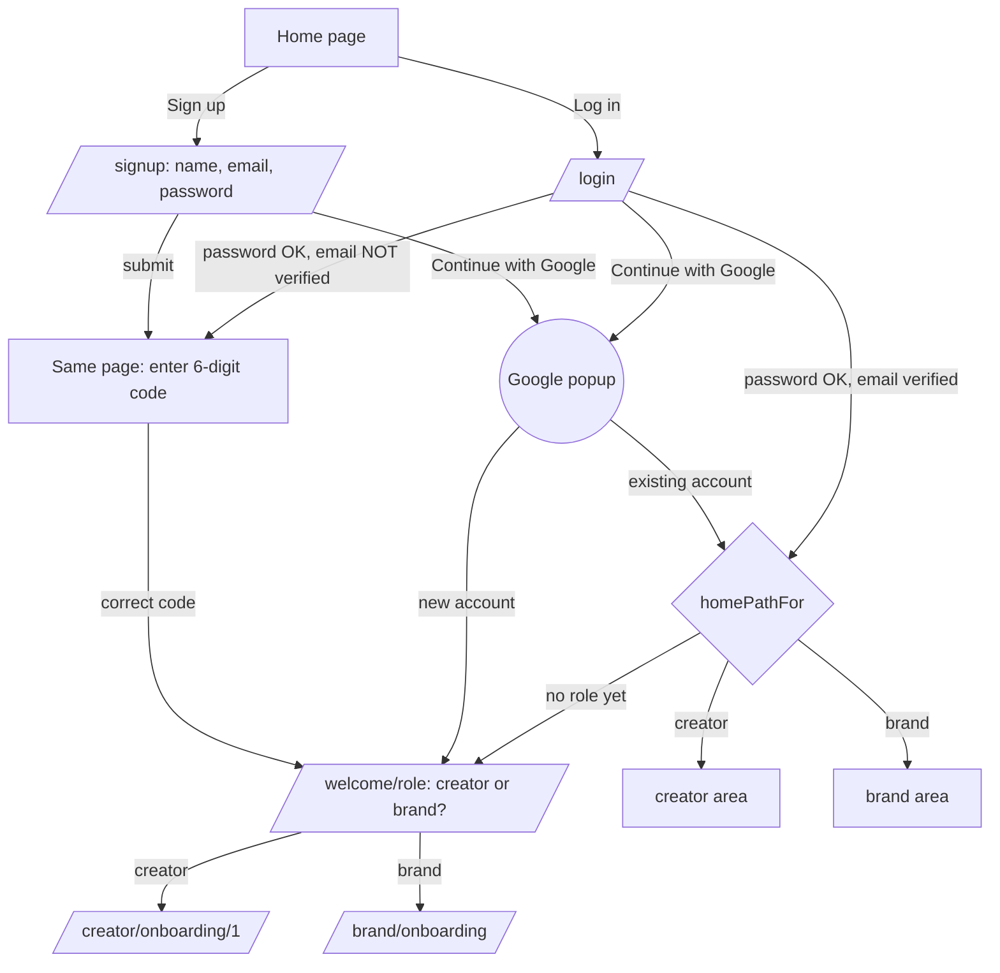
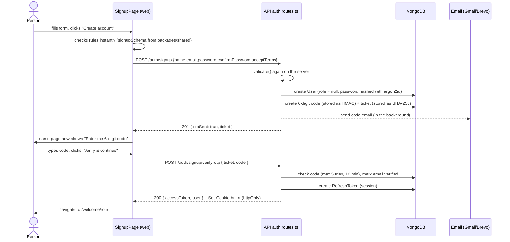
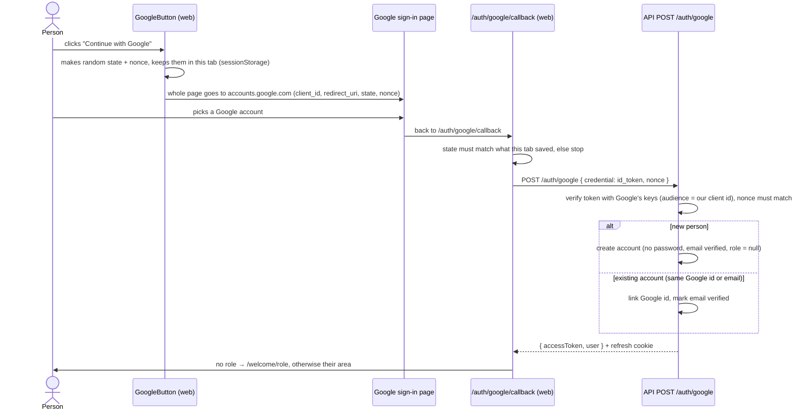
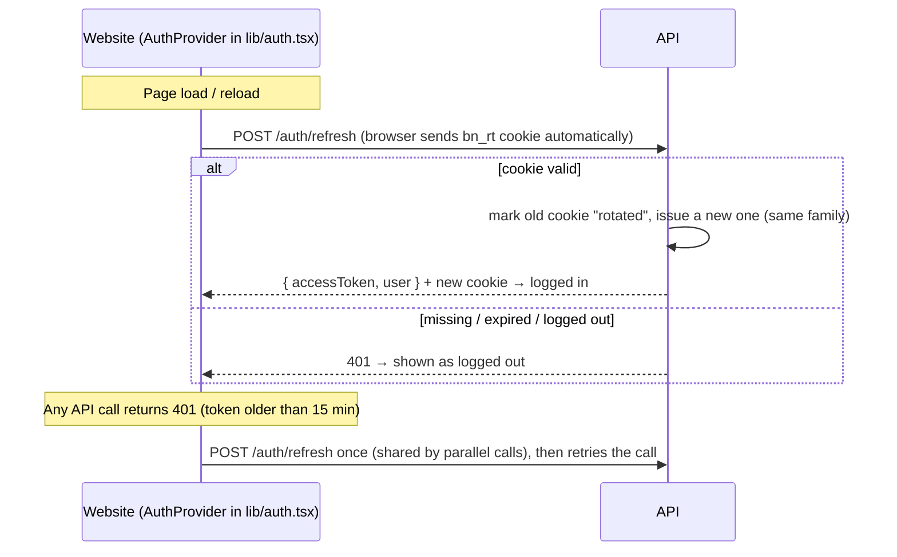
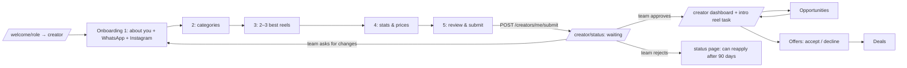

# Flows: what happens, what calls what, where you go next

This document follows every important journey step by step. For each step you get:

- **Page:** the screen and its React component.
- **API call:** what the page sends.
- **Server:** which file handles it and what it does.
- **✅ Success:** what happens next.
- **❌ Failure:** what the person sees.

The diagrams are written in [Mermaid](https://mermaid.js.org/). GitHub and VS Code (with the "Markdown Preview Mermaid Support" extension) draw them automatically.

> **How a click becomes data (the same pattern every time)**
> 1. A page in `apps/web/src/pages/...` calls `api.post('/auth/login', {...})` (from `apps/web/src/lib/api.ts`).
> 2. The browser sends `POST /api/v1/auth/login`. Vite (locally) or Vercel (live) forwards it to the API.
> 3. `apps/api/src/app.ts` runs the security middleware, then the matching route in `apps/api/src/modules/...`.
> 4. The route validates input, does the work (via a service or models) and replies `{ data }` or `{ error }`.
> 5. The page shows the result or navigates to the next page.

---

## Contents
1. [Accounts & login](#1-accounts--login)
   - [Sign up with email (+ 6-digit code)](#11-sign-up-with-email--6-digit-code)
   - [Continue with Google](#12-continue-with-google)
   - ["What brings you to Bluenova?" (choose creator or brand)](#13-what-brings-you-to-bluenova-role-choice)
   - [Log in](#14-log-in)
   - [Staying logged in, page reloads and logout](#15-staying-logged-in-page-reloads-and-logout)
   - [Forgot / reset password](#16-forgot--reset-password)
   - [Change password / log out everywhere](#17-change-password--log-out-everywhere)
   - [Where does a logged-in person land? (routing rules)](#18-where-does-a-logged-in-person-land)
2. [Creator journey](#2-creator-journey)
3. [Brand journey](#3-brand-journey)
4. [Team (admin panel) journeys](#4-team-admin-panel-journeys)
   - [Admin login (password + authenticator)](#41-admin-login)
   - [Review a creator](#42-review-a-creator)
   - [Campaign → shortlist → offers → start](#43-campaign--shortlist--offers--start)
   - [Users: view everyone, set a password, suspend](#44-users-view-everyone-set-a-password-suspend)
   - [Payments (only when switched on)](#45-payments-only-when-switched-on)
5. [Pop-up windows (dialogs/modals) in the apps](#5-pop-up-windows-dialogs--modals)
6. [Background jobs and emails](#6-background-jobs-and-emails)

---

## 1. Accounts & login

### Big picture



### 1.1 Sign up with email (+ 6-digit code)

**Page:** `/signup`, component `SignupPage` in `apps/web/src/pages/auth/AuthPages.tsx`.
**Fields:** name, email, password, confirm password, ☑ accept Terms & Privacy. No role question here.



| Step | ✅ Success | ❌ Failure (what the person sees) |
|---|---|---|
| Submit form | Code step appears on the same page | Red text under the field, e.g. "errors.passwordShort", "errors.emailDisposable", "errors.nameFake", "errors.passwordMismatch". Missing ☑ terms: "errors.consentRequired". Too many signups from one network (10/hour): "errors.RATE_LIMITED". |
| Enter code | Logged in, goes to `/welcome/role` | "Incorrect code" (`otpInvalid`), "This code has expired or was replaced" (`otpExpired`), "Too many wrong tries" (`otpTooMany`, after 5) |
| "Resend code" (after 60 s) | "A new code is on its way" | "Please wait a minute" (`otpCooldown`) |
| "Change email" | Back to the form | – |

**Special cases (all handled by `POST /auth/signup` in `apps/api/src/modules/auth/auth.routes.ts`):**
- **Email already registered and verified.**
  - The page *looks* identical: it shows the code step, but that ticket can never work.
  - The real owner gets an "you already have an account" email instead.
  - Why: so nobody can use the signup form to find out who has an account.
- **Email registered but never verified** (closed the tab or lost the code). A fresh code is sent. The new name and password apply only after the code is entered.
- **`TEST_MODE=true` on the server.** No code is needed: the reply contains `accessToken` and the person goes straight to `/welcome/role`.
- **Opening Log in in another tab before verifying.** Both tabs keep working with the same code.

### 1.2 Continue with Google

**Pages:** the "Continue with Google" button at the **top** of `/login` and `/signup` (`GoogleButton` in `AuthPages.tsx`), and the return page `/auth/google/callback` (`GoogleCallbackPage`).
It uses a **full-page redirect, not a pop-up**, because pop-up blockers, ad-blockers and Brave Shields often block Google's pop-up ("Failed to open popup window").



| ✅ Success | ❌ Failure (shown on the callback page, with "Back to log in") |
|---|---|
| New account → `/welcome/role`; existing → their area | Cancelled at Google → "Google sign-in was cancelled". Wrong/old/replayed token or state mismatch → "Google sign-in failed". Unverified Google email → "not verified". Team (admin) email → "This Google account is a Bluenova team account…". No `GOOGLE_CLIENT_ID` on the API → "not available yet". |

**Google Cloud settings this needs** (Clients → your Web client):
- **Authorized JavaScript origins:** `https://creator-hub-mu-five.vercel.app`, `http://localhost:5180`.
- **Authorized redirect URIs:** `https://creator-hub-mu-five.vercel.app/auth/google/callback`, `http://localhost:5180/auth/google/callback`.

No 6-digit code is needed, because Google has already proven the email. By continuing, the person accepts the terms (the text under the form says so); consent is recorded on the account.

### 1.3 "What brings you to Bluenova?" (role choice)

**Page:** `/welcome/role`, component `RoleSelectPage` in `AuthPages.tsx`. It is shown **once**, to every new account (email or Google), because the account has no role yet.

| Step | What happens |
|---|---|
| Pick a card | "I'm a creator / influencer" or "I want to promote my brand". **Continue** becomes active. |
| Continue | `POST /auth/role { role }`, handled by `auth.routes.ts`. In one database transaction the API sets `user.role` and creates an empty `CreatorProfile` or `BrandProfile`. |
| ✅ Success | The page reloads `/me`. Creators go to `/creator/onboarding/1`, brands go to `/brand/onboarding`. |
| ❌ Failure | "Your account type is already set" (409 `roleAlreadySet`, e.g. double click or a second tab). The page then sends them to their area. Sending `role: 'admin'` is rejected (400). |

The role can never be changed afterwards. Logged-in people without a role are always sent back here (see [1.8](#18-where-does-a-logged-in-person-land)).

### 1.4 Log in

**Page:** `/login`, component `LoginPage`. API: `POST /auth/login { email, password }`.

| Case | Server reply | Page does |
|---|---|---|
| Right password, email verified | `{ accessToken, user }` + refresh cookie | `postLoginPath()` sends them to their area, or to `?next=` if it's inside their area |
| Right password, email **never verified** | `{ needsVerification, ticket, email }` and a code is emailed | Switches to the same code step as signup |
| Wrong email **or** wrong password | 401 `errors.badCredentials` | "Incorrect email or password" (deliberately the same message for both) |
| 5 failures in 15 min for that email | 429 `errors.loginLocked` | "Too many attempts, try again in 15 minutes" |
| Account suspended | 403 `errors.accountInactive` | Red message |
| A team (admin) email | 401 `badCredentials` | Team members must use the admin panel |

### 1.5 Staying logged in, page reloads and logout

There are two keys, so a stolen page script can't steal a long-lasting login:

| Key | Where it lives | Lifetime | Used for |
|---|---|---|---|
| **Access token** (JWT) | JavaScript memory only (`packages/ui/src/api.ts`) | 15 minutes | Sent as `Authorization: Bearer …` on every API call |
| **Refresh cookie** `bn_rt` | httpOnly, Secure, SameSite=Strict cookie, path `/api/v1/auth` | 30 days (admins: 12 hours, cookie `bn_admin_rt`) | Getting a new access token |



- **Stolen-cookie protection:** if an already-used refresh cookie comes back more than 10 seconds later, it is treated as theft. That whole login family is logged out (`refreshSession` in `auth.service.ts`).
- **Logout** (menu → Log out): `POST /auth/logout` revokes this device's cookie, then the page goes to `/`.

### 1.6 Forgot / reset password

| Page | Action | ✅ Success | ❌ Failure |
|---|---|---|---|
| `/forgot-password` (`ForgotPasswordPage`) | `POST /auth/password/forgot { email }` | Always "If an account exists, we sent a link" (same reply for unknown emails). At most 1 email per minute per account. | Rate limited (20/hour per network) |
| Email | Link `…/reset-password#token=…` (valid **1 hour**, works **once**). Only the newest link works. | – | – |
| `/reset-password` (`ResetPasswordPage`) | Reads the token from the `#` part of the address (never sent to servers in logs), then `POST /auth/password/reset { token, password, confirmPassword }` | Password changed, **every device logged out**, "password changed" email sent. Goes to `/login` with a green note. | Weak password: shown under the field (the link is **not** used up, so they can try again). "This link was already used" / "has expired" / "is not valid". |

### 1.7 Change password / log out everywhere

**Page:** `/creator/settings` or `/brand/settings` (`SettingsPage` in `pages/shared/SharedPages.tsx`).
- **Change password:** `POST /auth/password/change { currentPassword, password, confirmPassword }`. Every *other* device is logged out; this one gets a fresh session. A wrong current password shows an error under that field.
- **Log out everywhere:** `POST /auth/logout-all`. All sessions are revoked, then the page goes to `/`.

### 1.8 Where does a logged-in person land?

`homePathFor(me)` in `apps/web/src/lib/auth.tsx` decides from the **server's** data:

| Situation | Goes to |
|---|---|
| No role yet | `/welcome/role` |
| Creator with profile DRAFT or CHANGES_REQUESTED | `/creator/onboarding/<step they reached>` |
| Creator SUBMITTED, UNDER_REVIEW or REJECTED | `/creator/status` |
| Creator APPROVED | `/creator` (dashboard) |
| Brand with profile INCOMPLETE | `/brand/onboarding` |
| Brand ACTIVE | `/brand` (dashboard) |

**Route guards** (in `apps/web/src/App.tsx` and `lib/auth.tsx`):
- `GuestOnly` (login/signup pages): already logged in → `homePathFor`.
- `RequireSignedIn` (`/welcome/role`): not logged in → `/login?next=…`.
- `RequireRole role="creator"` (everything under `/creator`): not logged in → `/login?next=…`; the wrong role → their own home.

The guards are only for convenience. **The API re-checks everything.**

---

## 2. Creator journey



| Step | Page / component | API | ✅ Next | ❌ Failure |
|---|---|---|---|---|
| Onboarding steps 1–4 | `/creator/onboarding/:step`, `CreatorOnboarding` (`pages/creator/Onboarding.tsx`) | `PUT /creators/me/onboarding/:step` | Next step | Field errors under inputs. 409 if the profile is no longer editable. |
| Step 5 submit | same | `POST /creators/me/submit` (the server re-checks **all** stored steps and the creator agreement) | `/creator/status`; reviewers get a notification | `errors.profileIncomplete`, listing what's missing |
| Waiting for review | `/creator/status`, `CreatorStatusPage` | `GET /creators/me` | – | – |
| Reapply after rejection | status page button | `POST /creators/me/reapply` (only after `reapplyAfter`) | Back to onboarding step 1 | 409 if too early |
| Opportunities (approved only) | `/creator/opportunities` | `GET /opportunities`, `POST /opportunities/:id/interest` | "Interested" toggled | 403 `notApprovedYet` |
| Offers | `/creator/offers`, `/creator/offers/:id` | `GET /offers`, `POST /offers/:id/accept` or `/decline` | Accept: a **Deal** is created (AWAITING_PAYMENT) and the brand and team are notified | 409 if expired (48 h) or already answered |
| Deals | `/creator/deals` | `GET /deals` | – | – |

---

## 3. Brand journey

```mermaid
flowchart LR
  R[/welcome/role → brand/] --> BO[/brand/onboarding: company details/]
  BO -->|PUT /brands/me| BD[/brand dashboard/]
  BD --> CW[New campaign wizard 5 steps] -->|POST /campaigns/:id/submit| CD[Campaign page: waiting for shortlist]
  CD -->|team sends shortlist| SL[Shortlist: pick creators]
  SL -->|POST shortlist/select| OF[Offers sent to creators]
  OF -->|creators accept| PP[Payment pending]
  PP -->|team clicks Start, or payment verified| AC[Campaign ACTIVE]
```



| Step | Page | API | ✅ Next | ❌ Failure |
|---|---|---|---|---|
| Company details (first time) | `/brand/onboarding`, `BrandOnboardingPage` | `PUT /brands/me` (GSTIN check digit, PIN↔state, real phone) | Profile becomes **ACTIVE** and the brand agreement is recorded; goes to `/brand` | Field errors |
| Campaign wizard | `/brand/campaigns/new` → `/brand/campaigns/:id/edit/2..5`, `CampaignWizard` | Step 1 `POST /campaigns`; steps 2–5 `PUT /campaigns/:id/wizard/:step` | Next step | Field errors. 403 `brandProfileIncomplete` if company details are missing. |
| Submit | wizard final step | `POST /campaigns/:id/submit` (re-validates everything) | `/brand/campaigns/:id`; campaign managers notified | `errors.campaignIncomplete`, listing each step's problems |
| See shortlist | `/brand/campaigns/:id`, `CampaignDetailPage` | `GET /campaigns/:id/shortlist` (empty until the team sends it) | – | – |
| Select creators | same page | `POST /campaigns/:id/shortlist/select { itemIds }` | One **Offer** per selected creator (expires in 48 h); creators notified | 409 if the shortlist isn't open |
| Cancel campaign | same page → dialog | `POST /campaigns/:id/cancel { reason }` | Open offers withdrawn, unpaid deals cancelled | 409 if already active |
| Pay (only if payments are ON) | `/brand/campaigns/:id/payment`, `PaymentPage` | `GET /campaigns/:id/checkout`, `POST /campaigns/:id/payments` | "Waiting for verification" | Amount mismatch, reference already used |

A brand can only load **its own** campaigns: any other id returns 404 (`ownCampaign()` in `brands.routes.ts`).

---

## 4. Team (admin panel) journeys

### 4.1 Admin login
**Page:** admin `/login` (`LoginPage` in `apps/admin/src/pages/Shell.tsx`).

```mermaid
sequenceDiagram
  actor T as Team member
  participant P as Admin LoginPage
  participant A as API
  T->>P: email + password
  P->>A: POST /auth/admin/login
  A-->>P: { mfaToken } (valid 5 min; not a login yet)
  T->>P: 6-digit code from Google Authenticator
  P->>A: POST /auth/admin/totp/verify { mfaToken, code }
  A->>A: code checked (each code works once), session started
  A-->>P: { accessToken, user } + cookie bn_admin_rt (12 h)
  P->>T: dashboard /
```

❌ Wrong email or password: "Incorrect email or password". Wrong or reused code: "Incorrect or expired authenticator code". After 5 failures: locked for 15 minutes. Creator and brand accounts can't log in here.

### 4.2 Review a creator
Admin `/creators` → `/creators/:id` (`CreatorDetailPage`).
1. **Claim:** `POST /admin/creators/:id/claim` (SUBMITTED → UNDER_REVIEW).
2. **Decide:** `POST /admin/creators/:id/decision` with APPROVED, CHANGES_REQUESTED or REJECTED, scores and a message.
   - **Approve:** the creator becomes an Official Partner and an **intro-reel deal** is created.
   - **Reject:** they can reapply after 90 days.
   - The creator is notified and the decision is written to the audit log.

### 4.3 Campaign → shortlist → offers → start
Admin `/campaigns/:id` (`CampaignDetailPage`).
1. **Claim** the campaign: `POST /admin/campaigns/:id/claim` (SUBMITTED → IN_REVIEW).
2. **Matches:** `GET /admin/campaigns/:id/matches` returns approved creators ranked by match score.
3. **Add to shortlist:** `POST /admin/campaigns/:id/shortlist` with the creator payout and an optional brand price. If no brand price is given, the payout plus a 25% margin, rounded up to ₹100, is used.
4. **Send to brand:** `POST /admin/campaigns/:id/shortlist/send`. The brand is notified.
5. The brand selects creators, offers go out, and creators accept. The campaign becomes PAYMENT_PENDING.
6. **Start campaign** (payments OFF): `POST /admin/campaigns/:id/start`. Deals go to IN_PRODUCTION, the campaign becomes ACTIVE, and creators and the brand are notified.

### 4.4 Users: view everyone, set a password, suspend
**Super admins only.** Admin menu → **Users** (`apps/admin/src/pages/Users.tsx`); the API is `apps/api/src/modules/admin/users.routes.ts`.

| Screen / action | API | Result |
|---|---|---|
| `/users`: table with tabs All / Creators / Brands / No role yet / Team, plus search | `GET /admin/users?role=&q=` | Name, email, how they log in (password / Google), type, profile summary (company or Instagram handle, city, status), phone, verified?, joined, last login |
| `/users/:id`: one account | `GET /admin/users/:id` (recorded in the audit log as `user.view`) | Everything above plus the full creator or brand profile, accepted terms, and logged-in devices |
| **Set new password** (dialog) | `POST /admin/users/:id/password { password, reason }` | New password saved (same rules as signup), the user is **logged out everywhere** and emailed "your password was changed", and it's audited |
| **Suspend / Re-activate** (dialog) | `POST /admin/users/:id/status { status, reason }` | Suspend logs them out now and blocks login. Audited. |

**Why there is no "show password" column:**
- Passwords are stored only as **argon2id hashes**. A hash is a one-way fingerprint, so nobody (not even us) can turn it back into the password.
- This protects every user if the database ever leaks.
- For testing, set a new password, then log in as that user with it.
- Team accounts can't be changed here; they use their own Settings.

### 4.5 Payments (only when switched on)
Admin **Settings** → payments switch (`PUT /admin/settings/features`, super admin). When ON:
1. The brand pays by bank or UPI and reports the reference (`POST /campaigns/:id/payments`).
2. Finance opens `/payments` and checks the bank statement.
3. **Verify:** deals start. **Reject:** the brand can resubmit (`POST /admin/payments/:id/review`).
4. While OFF, all brand payment URLs answer 404 and step 6 of [4.3](#43-campaign--shortlist--offers--start) is used instead.

---

## 5. Pop-up windows (dialogs / modals)

All pop-ups use the one shared `Dialog` component (`packages/ui/src/components.tsx`).
- It's accessible: Esc closes it, focus moves inside, and clicking the dark background closes it.
- It slides up from the bottom on phones.

| App | Where | Dialog | Confirms → API |
|---|---|---|---|
| Website | Brand campaign page (`BrandPages.tsx`) | "Cancel campaign" with a reason | `POST /campaigns/:id/cancel` |
| Website | Creator offer page (`CreatorPages.tsx`) | "Accept offer" confirmation | `POST /offers/:id/accept` |
| Website | Creator offer page | "Decline" with a reason | `POST /offers/:id/decline` |
| Admin | Payments (`Finance.tsx`) | "Verify / Reject this payment?" | `POST /admin/payments/:id/review` |
| Admin | User detail (`Users.tsx`) | "Set a new password" | `POST /admin/users/:id/password` |
| Admin | User detail (`Users.tsx`) | "Suspend / Re-activate this account?" | `POST /admin/users/:id/status` |

The 6-digit code step is **not** a pop-up: it replaces the signup or login form on the same page.

---

## 6. Background jobs and emails

| What | When | File |
|---|---|---|
| Expire unanswered offers (48 h) and notify the creator | Every 10 minutes, inside the API | `apps/api/src/jobs/scheduler.ts` |
| Signup code email | Signup, resend, or login with an unverified email | `emails.otp` in `providers/email.ts` |
| "You already have an account" | Signup with a registered, verified email | `emails.alreadyRegistered` |
| Reset link | Forgot password | `emails.reset` |
| "Your password was changed" | Reset, change, or an admin setting a password | `emails.passwordChanged` |

All emails are sent **in the background** (`sendInBackground`), so a slow mail server never slows down the page. If sending fails, the reason is logged. In development, the code or link is also printed in the terminal.
